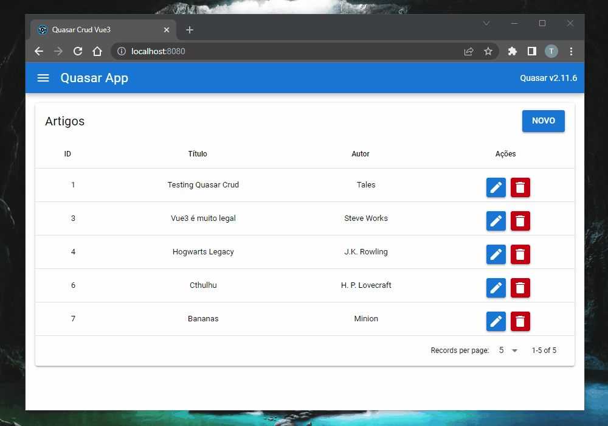

<h1 align="center">
  <br>
  Crud com Quasar e Axios
  <br>
</h1>

<h4 align="center">Um pequeno projeto utilizando o Axios com Quasar para se comunicar com APIs.</h4>

<p align="center">
  <a href="#principais-características">Características</a> •
  <a href="#como-usar">Como usar</a> •
  <a href="#créditos">Créditos</a> •
  <a href="#licença">Licença</a>
</p>



## Principais Características

* CRUD
  - Create, Read, Update, Delete: são as quatro operações básicas do desenvolvimento de uma aplicação.
* Axios
  - Utilizando o Axios, você se comunica de forma rápida e simples com qualquer API, facilitando muito na comunicação entre o cliente e o servidor.
* Quasar Framework
  - Uma biblioteca que utiliza o VueJs como base. Facilita muito na criação de aplicações com um design bonito e soluções lógicas simples de serem utilizadas.
* Json Server
  - Aplicação que simula uma API para fazermos testes com a interação entre Frontend e Backend.

## Como usar

Para clonar essa aplicação, você vai precisar do [Git](https://git-scm.com) e do [Node.js](https://nodejs.org/en/download/) (que vem com o [npm](http://npmjs.com)) instalados em seu computador. Em um terminal, siga esses passos:

```bash
# Clone este repositório
$ git clone https://github.com/sselat/quasar-crud

# instale as dependências da aplicação
$ npm install

# acesse a pasta do banco de dados Json
$ cd src/db/

# pode ser necessário o uso do npx
$ json-server --watch db.json
$ npx json-server --watch db.json

# retorne para a pasta principal da aplicação
cd ../../

# Inicie a aplicação na pasta principal
$ quasar dev
```

## Créditos

Aplicações Open Source utilizadas:

- [Node.js](https://nodejs.org/)
- [Quasar](https://github.com/quasarframework/quasar)
- [Axios](https://github.com/axios/axios)
- [Vue](https://github.com/vuejs/vue)

## Licença

MIT

---

